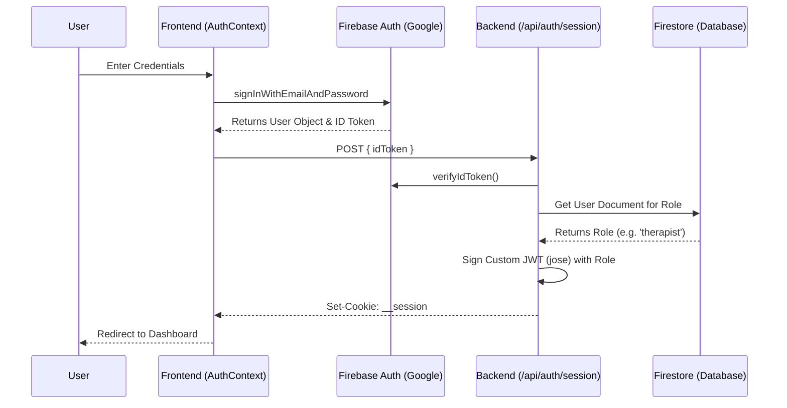
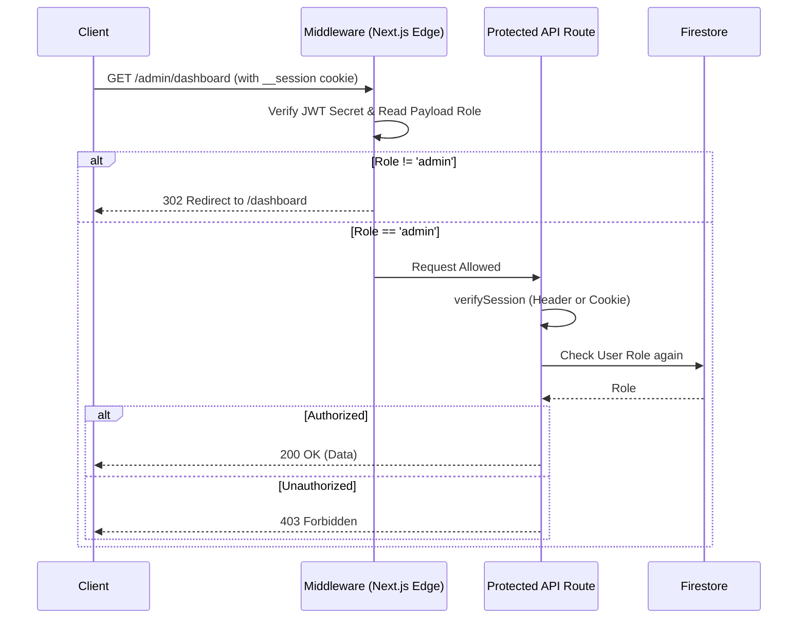

# Saarthi - Authentication & Authorization Deep Audit Report

**Date:** July 2024
**Reviewer:** Principal Security Engineer / Next.js Core Contributor
**Scope:** Full authentication, authorization, session, middleware, and identity system audit.

---

## Executive Summary

The Saarthi authentication architecture is currently **severely fractured**. Instead of a single source of truth, it implements **three separate and conflicting authentication paradigms** simultaneously:
1. Firebase Client Auth ID Tokens (passed via `Authorization: Bearer`).
2. Custom Edge-Verifiable JWTs (`jose`) stored in an `__session` cookie.
3. Firebase Custom Claims (which are never actually set, but are sometimes assumed to exist).

This split-brain architecture leads to critical authorization bypass vulnerabilities, massive code duplication, inconsistent API protection, and a highly unstable developer experience. A complete, centralized rewrite of the session verification flow is required before production launch.

## 1. Login Flow

**Trace:**
1. User enters credentials in `login/page.tsx` -> calls `useAuth().login()`.
2. `AuthContext` calls `authService.login()`, which invokes Firebase Client `signInWithEmailAndPassword`.
3. Firebase Client logs the user in.
4. `AuthContext` has an `onAuthStateChanged` listener that fires.
5. `AuthContext` fetches the user's role from Firestore (`authService.getUserRole(firebaseUser.uid)`).
6. **The Critical Split:** `AuthContext` takes the Firebase ID Token (`await firebaseUser.getIdToken()`) and posts it to `/api/auth/session`.
7. `/api/auth/session` verifies the ID Token, fetches the role *again* from Firestore, and creates a completely new, custom JWT using `jose.SignJWT`.
8. This custom JWT is set as an HTTP-only cookie (`__session`).
9. `AuthContext` sets the React state to logged in and calls `router.refresh()`.

**Flaws & Risks:**
*   **Double Source of Truth:** The client has a Firebase Session, AND the browser has a Custom JWT session cookie. If they get out of sync, the UI might show a logged-in state while API requests fail, or vice-versa.
*   **Role Desync:** The role is baked into the custom JWT for 5 days. If an admin demotes a therapist, the therapist retains therapist privileges for 5 days unless they explicitly log out, because the middleware only checks the JWT payload.

## 2. Signup Flow

**Trace:**
1. `AuthContext.register` calls `authService.register`.
2. `createUserWithEmailAndPassword` creates the Firebase user.
3. `authService.register` creates a document in the `users` Firestore collection with `role: 'client'`.
4. `onAuthStateChanged` fires, fetching the role and creating the `__session` cookie.

**Flaws & Risks:**
*   **Race Conditions:** If the `users` document creation fails (network error, firestore rules), the user is created in Firebase Auth but has no profile. Subsequent logins will fail or error out during role fetching, leaving an orphaned account.
*   **Admin/Therapist Creation:** Admin and Therapist roles cannot be created via the standard flow. They must be manually edited in Firestore, which means the session cookie will not reflect the new role until the user logs out and logs back in.

## 3. Session Architecture

The application is suffering from "Identity Confusion".
*   **Source 1 (Middleware):** Reads the `__session` cookie, verifies it with a secret (`JWT_SECRET`), and checks `payload.role`.
*   **Source 2 (APIs using `verifySession`):** Attempts to read the `Authorization: Bearer` header. If it exists, it tries to decode it as a custom JWT. If *that* fails, it assumes it's a Firebase ID Token, verifies it with `adminAuth.verifyIdToken`, and fetches the role from Firestore.
*   **Source 3 (APIs using `checkTherapistAccess`):** Explicitly demands `Authorization: Bearer`, assumes it is a raw Firebase ID token, verifies it, and queries Firestore for the role.

**Conclusion:** There are three completely different ways identity is resolved on the backend. This is not a single architecture; it is three architectures competing with each other.

## 4. Authentication Helpers

The codebase contains massive duplication and conflicting logic:

*   `verifySession.ts`: Tries to handle both Custom JWTs and Firebase ID Tokens gracefully.
*   `requireRole.ts`: Wraps `verifySession.ts` to enforce RBAC.
*   `checkTherapistAccess.ts`: A completely separate auth helper used only by therapist APIs that bypasses `verifySession` entirely and expects Firebase ID tokens.
*   `middleware.ts`: A completely separate auth helper that ONLY understands the `__session` cookie and custom JWTs.

**Verdict:** Authentication logic is highly duplicated and inconsistent.

## 5. Middleware

**Trace:**
1. Extracts `__session` cookie.
2. Verifies using `jose.jwtVerify`.
3. Reads `decodedRole`.
4. Restricts `/admin` to `admin`.
5. Restricts `/therapist` to `therapist` or `admin`.
6. Restricts `/dashboard` to anyone with a valid session.

**Flaws & Risks:**
*   **Token Refresh:** The custom JWT has a hardcoded 5-day expiration (`5d`). There is absolutely no logic in the middleware or `AuthContext` to refresh this token. On day 6, the user is abruptly kicked out, even if they have been actively using the application, because their Firebase Client session (which refreshes automatically) is disconnected from the custom `__session` cookie.
*   **Secret Fallback:** `process.env.JWT_SECRET || 'fallback-dev-secret-do-not-use-in-prod'`. If `JWT_SECRET` is missing in production, the app uses a known fallback, allowing complete account takeover by forging JWTs.

## 6. API Authentication Matrix

| API Route | Authentication Method | Authorization Method | Status |
| :--- | :--- | :--- | :--- |
| `/api/bookings/create` | `verifySession` (Header/Cookie) | `uid` passed to Command | ⚠️ Mixed |
| `/api/bookings/reschedule` | `verifySession` (Header/Cookie) | `session.role` | ✅ Consistent |
| `/api/bookings/lock-slot` | `verifySession` (Header/Cookie) | Basic presence | ✅ Consistent |
| `/api/therapist/availability/*` | `checkTherapistAccess` | Firestore query inside helper | ❌ Conflicting |
| `/api/operations/*` | `verifyIdToken` (Header only) | Hardcoded token verify | ❌ Conflicting |
| `/api/email/resend` | `verifyIdToken` (Header only) | Hardcoded token verify | ❌ Conflicting |

**Conclusion:** Different domains (Booking vs Therapist vs Operations) were built by different developers or at different times using entirely different authentication mental models.

## 7. Authorization

RBAC (Role-Based Access Control) is fundamentally broken due to the reliance on the Custom JWT payload.

*   If an Admin revokes a Therapist's access in Firestore, the Therapist can continue to access the `/therapist` routes and perform actions for up to 5 days, because the Next.js `middleware.ts` only reads the `role` from the custom JWT payload, which is not revoked.
*   Guest users for bookings (`guest_${crypto.randomUUID()}`) bypass traditional auth but are allowed to create bookings. However, they cannot manage them because Firestore rules demand `resource.data.userId == request.auth.uid`.

## 8. Firestore Roles

The "Single Source of Truth" for roles *should* be the `users/{uid}` document in Firestore.
However, because `/api/auth/session` copies this role into a custom JWT, the custom JWT becomes a stale, secondary source of truth that middleware relies on.

If there is a conflict, the Custom JWT wins for routing (Middleware), but Firestore wins for data access (Firestore Rules). This causes bizarre UI bugs where a demoted user can access the `/admin` page but sees "Permission Denied" errors when loading data.

## 9. Firebase Custom Claims

**Audit Results:**
A search for `setCustomUserClaims` yields **0 results**.
Firebase Custom Claims are **not used** anywhere in this application.
The application incorrectly built an entirely custom JWT infrastructure (`jose`, `__session` cookie) to emulate the exact behavior that Firebase Custom Claims provides natively via Session Cookies.

## 10. Token Flow

**Current Broken Flow:**
Client (Firebase SDK) -> gets ID Token -> sends to `/api/auth/session` -> server creates Custom JWT -> sets `__session` cookie -> Client (fetch) -> sends Authorization header with ID token OR relies on cookie -> API tries to parse Custom JWT -> if fails, parses ID token.

## 11. Frontend Authentication

*   `AuthContext` relies on `onAuthStateChanged`. This is robust.
*   However, `AuthContext` makes a highly brittle network request to `/api/auth/session` on every auth state change. If this network request fails, the user is logged into Firebase but locked out of Next.js middleware routes.
*   `lib/fetchWithAuth.ts` aggressively attaches `Authorization: Bearer ${token}` to API requests. This conflicts with the `__session` cookie approach.

## 12. Security Review

### 🔴 CRITICAL VULNERABILITIES

1.  **Stale Privilege Escalation / Revocation Failure:**
    *   *Issue:* `middleware.ts` trusts the `role` inside the custom JWT for 5 days.
    *   *Impact:* An employee or therapist who is terminated retains access to all internal pages and APIs that rely on `verifySession().role` for 5 days.
2.  **Hardcoded JWT Secret Fallback:**
    *   *Issue:* `process.env.JWT_SECRET || 'fallback-dev-secret-do-not-use-in-prod'`.
    *   *Impact:* If env vars are misconfigured, attackers can mint admin JWTs.
3.  **Guest Account Security Bypass:**
    *   *Issue:* Bookings can be created with `guest_${crypto.randomUUID()}`.
    *   *Impact:* There is no cryptographic verification of guest identity.

### 🟠 HIGH VULNERABILITIES

1.  **Session Fixation / Lack of Refresh:**
    *   *Issue:* The custom JWT is never refreshed. It hard expires in 5 days.
    *   *Impact:* Users are forcefully logged out during active sessions.
2.  **Orphaned Accounts:**
    *   *Issue:* Creating the Firebase Auth user and the Firestore `users` document are not atomic.
    *   *Impact:* Network failures during signup leave users in a broken state where they can login but have no role.

## 13. Top Authentication Bugs

1.  APIs under `/api/therapist` use `checkTherapistAccess` which strictly requires an `Authorization` header containing a Firebase ID token. APIs under `/api/bookings` use `verifySession` which accepts custom JWTs via cookies.
2.  Middleware relies exclusively on the custom JWT cookie, completely ignoring Firebase ID tokens.
3.  Logging out fails to invalidate the custom JWT if the `/api/auth/session` network request fails.
4.  No token refresh mechanism for the custom JWT.
5.  If `adminAuth.verifyIdToken` is called in `verifySession` on a revoked token, it will throw, causing a 500 instead of a 401.

## 14. Refactoring Plan (The "One True Path")

**The fundamental error in this codebase was trying to build a Custom JWT system on top of Firebase.** Firebase already has a built-in, secure, and automatically refreshing session management system: **Firebase Session Cookies.**

### Step-by-Step Migration to a Single Source of Truth

**Phase 1: Standardization (Move to Firebase Session Cookies)**
1.  **Delete `process.env.JWT_SECRET` and `jose`.** You do not need to mint your own JWTs.
2.  **Rewrite `/api/auth/session`:** Instead of using `jose.SignJWT`, use Firebase Admin's native `adminAuth.createSessionCookie(idToken, { expiresIn })`. Set *this* token as the `__session` cookie.
3.  **Rewrite `middleware.ts`:** Middleware cannot easily verify Firebase Session Cookies because it requires Node.js `crypto` which Edge runtimes lack.
    *   *Solution A:* Accept that Edge middleware can only do basic routing based on the *presence* of the `__session` cookie, and let the page layouts/APIs do the actual `adminAuth.verifySessionCookie()` check.
    *   *Solution B:* Use `next-firebase-auth-edge` library to properly decode Firebase tokens on the Edge.

**Phase 2: Consolidation of Helpers**
1.  **Delete `checkTherapistAccess.ts`.**
2.  **Rewrite `verifySession.ts`:**
    ```typescript
    export async function verifySession(request: Request) {
      const sessionCookie = request.cookies.get('__session')?.value;
      if (!sessionCookie) return null;
      try {
        const decodedClaims = await adminAuth.verifySessionCookie(sessionCookie, true);
        const userDoc = await adminDb.collection('users').doc(decodedClaims.uid).get();
        return { uid: decodedClaims.uid, role: userDoc.data()?.role };
      } catch { return null; }
    }
    ```
3.  **Update all APIs:** Force every single API route to use the unified `requireRole.ts` or `verifySession.ts` helper. Delete all direct references to `verifyIdToken` in API routes.

## Final Questions Answered

**1. Does Saarthi currently have one authentication system or multiple?**
Multiple. It has three conflicting systems (Firebase Auth, Custom JWTs, scattered ID Token verification).

**2. Is there duplicated authentication logic?**
Yes, heavily. `verifySession`, `checkTherapistAccess`, and random API routes all implement their own identity resolution logic.

**3. Are Firebase ID Tokens and custom session JWTs mixed incorrectly?**
Yes. The client sends ID tokens, the server mints custom JWTs, and different APIs expect different formats.

**4. Are Firestore roles implemented consistently?**
No. Middleware trusts the stale role in the custom JWT; APIs fetch the fresh role from Firestore.

**5. Are Firebase Custom Claims actually used?**
No. They are completely absent from the codebase.

**6. Which authentication abstraction should become the single source of truth?**
Firebase Session Cookies verified via `adminAuth.verifySessionCookie`.

**7. Which files should be deleted?**
*   `src/app/api/therapist/_lib/authCheck.ts`
*   Any API route doing manual `adminAuth.verifyIdToken`.

**8. Which files should be rewritten?**
*   `src/app/api/auth/session/route.ts` (Use Firebase Session Cookies)
*   `src/middleware.ts` (Use Edge-compatible Firebase decoding or defer auth to layouts)
*   `src/lib/auth/verifySession.ts` (Standardize on Session Cookies)

**9. Which files should never perform authentication directly?**
API Controllers (e.g., `src/app/api/operations/search/route.ts`). They should only use `requireAuthenticated` or `requireRole`.

**10. Would you approve this authentication architecture for production?**
**Absolutely Not.** It is highly insecure, vulnerable to privilege escalation via stale tokens, suffers from identity confusion, and lacks a robust token refresh mechanism. It must be rewritten to use native Firebase Session Cookies.

## Authentication Architecture Diagram

```mermaid
graph TD
    Client[Browser/Client]
    AuthContext[AuthContext React State]
    FirebaseAuth[Firebase Auth Service]
    AuthSessionAPI[/api/auth/session]
    NextMiddleware[Next.js Middleware]
    ProtectedAPI[Protected APIs]
    FirestoreDB[(Firestore Users)]

    Client -->|1. loginWithEmailAndPassword| FirebaseAuth
    FirebaseAuth -->|2. Returns User & ID Token| AuthContext
    AuthContext -->|3. POST ID Token| AuthSessionAPI
    AuthSessionAPI -->|4. verifyIdToken| FirebaseAuth
    AuthSessionAPI -->|5. Fetch Role| FirestoreDB
    AuthSessionAPI -->|6. Set __session Cookie (Custom JWT)| Client

    Client -->|7. Navigation Request with __session| NextMiddleware
    NextMiddleware -->|8. Verify Custom JWT Secret| NextMiddleware
    NextMiddleware -->|9. Allow/Deny Route| Client

    Client -->|10. API Request with __session OR Header| ProtectedAPI
    ProtectedAPI -->|11. Verify Custom JWT OR ID Token| ProtectedAPI
    ProtectedAPI -->|12. Fetch Role| FirestoreDB
```

## Authentication Flow Diagram



## Authorization Flow Diagram



## Top 20 Authentication Bugs & Improvements

### Bugs

1.  **Multiple Sources of Truth:** `verifySession.ts` parses both custom JWTs and Firebase ID tokens.
2.  **Auth Bypass:** `checkTherapistAccess.ts` ignores the `__session` cookie entirely.
3.  **Stale Roles:** `middleware.ts` relies on a 5-day old custom JWT payload for routing.
4.  **No Token Refresh:** The custom JWT in `__session` is never refreshed.
5.  **Hardcoded Fallback Secret:** `process.env.JWT_SECRET` defaults to a known string in `route.ts`.
6.  **Unverified Guest Bookings:** Guest bookings lack cryptographic verification.
7.  **Missing Error Handling:** `verifySession.ts` suppresses errors and returns `null` generically.
8.  **Orphaned Accounts:** Signup failure in Firestore leaves a valid Firebase Auth user without a profile.
9.  **Conflicting APIs:** Some routes use `verifyIdToken`, others use `verifySession`.
10. **Race Conditions:** `onAuthStateChanged` fires before the backend session cookie is ready.
11. **Logout Invalidation:** Failing to contact `/api/auth/session` during logout leaves the cookie active.
12. **Double Verification:** APIs using `checkTherapistAccess` re-verify the token and re-fetch the role, wasting performance.
13. **Middleware Logic Leak:** `middleware.ts` contains hardcoded role routing logic instead of centralizing it.
14. **Lack of Rate Limiting:** Login endpoints have no brute-force protection.
15. **Unused Code:** No usage of Firebase Custom Claims despite it being the recommended pattern.

### Improvements

16. **Migrate to Firebase Session Cookies:** Remove `jose` and use native Firebase `createSessionCookie`.
17. **Standardize Auth Helper:** Create a single `requireAuth` helper and delete `checkTherapistAccess`.
18. **Atomic Signups:** Implement a cloud function or webhook to guarantee user profile creation upon signup.
19. **Edge Authentication:** Use `next-firebase-auth-edge` for secure token decoding in Middleware.
20. **Audit Logging for Auth:** Add logging for failed logins, role changes, and token revocations.
