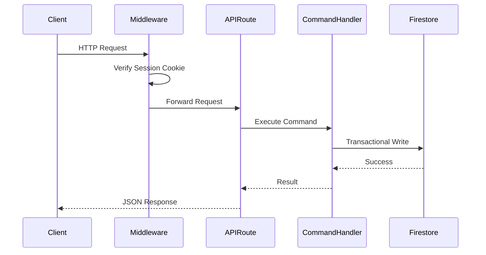
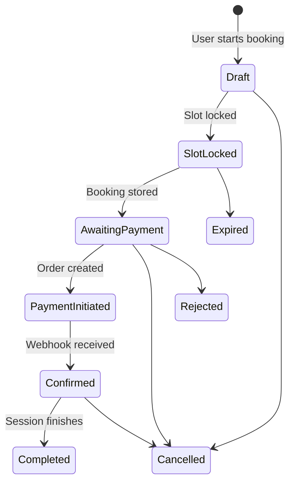
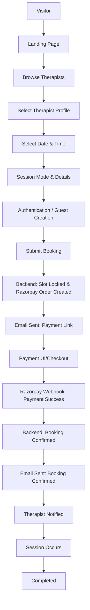
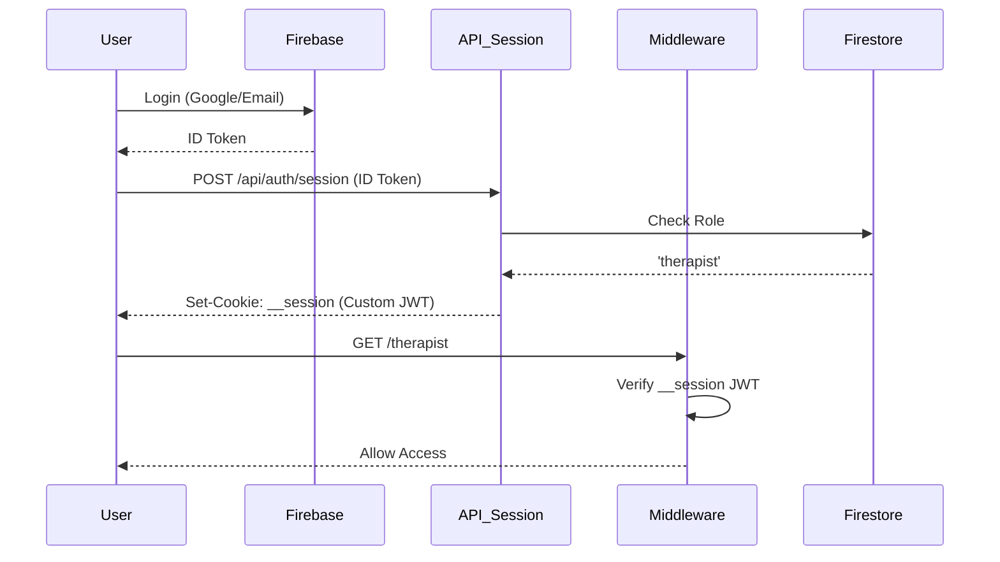
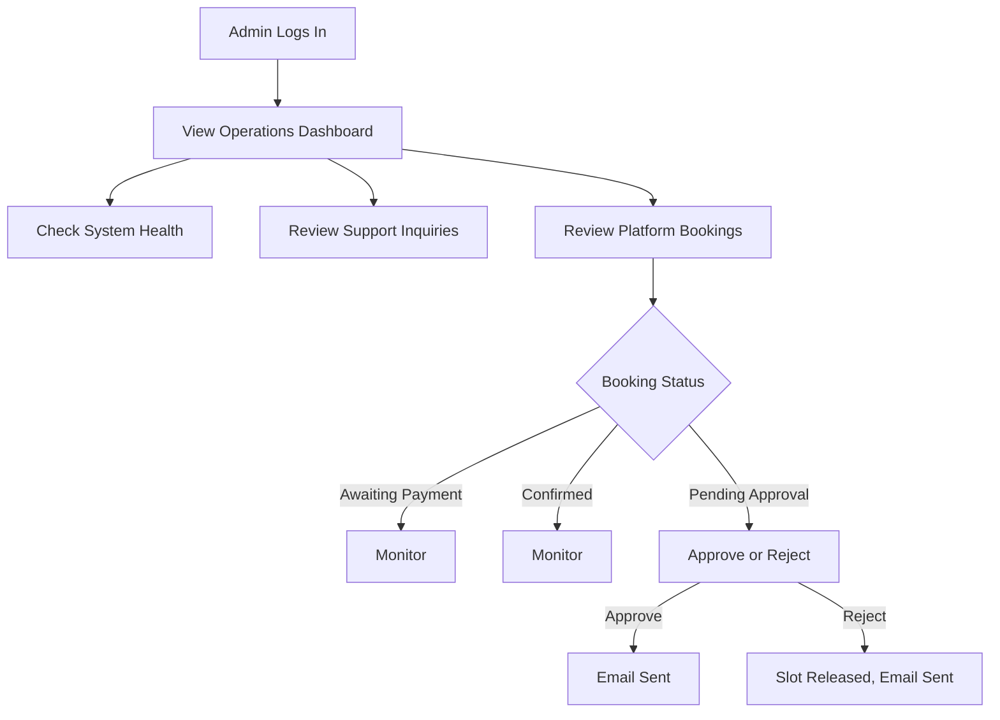

# Saarthi - Complete System Documentation

## 1. High Level Architecture

### Project Purpose
Saarthi is a mental health platform designed to connect clients with therapists. It facilitates therapist discovery, availability management, appointment booking, payment processing (Razorpay), email notifications (Resend), and role-based dashboards (Admin, Therapist, Client).

### Tech Stack
*   **Framework:** Next.js (App Router)
*   **Language:** TypeScript
*   **Styling:** TailwindCSS, class-variance-authority, clsx
*   **Animation:** Framer Motion
*   **Database:** Firebase Firestore
*   **Authentication:** Firebase Auth (Client) + Custom JWT Session Cookies (`jose`) + Next.js Middleware
*   **Payments:** Razorpay
*   **Email:** Resend
*   **Testing:** Vitest

### Folder Structure
*   `src/app`: Next.js App Router pages and API routes.
*   `src/components`: Reusable React components (UI, dashboard, admin, auth, forms, layout).
*   `src/contexts`: React Contexts (Auth, Booking).
*   `src/domains`: Domain-Driven Design (DDD) logic (CQRS commands, state machines, repositories, events for Booking, Payment, Audit).
*   `src/server`: Legacy/Alternative controllers and services (Split-brain architecture with DDD).
*   `src/services`: Client-side service wrappers (Firebase interactions, API calls).
*   `src/shared`: Shared utilities (events, errors, logger, config).

### Design Architecture
The application is currently in a transitional state between a procedural monolithic architecture and a Domain-Driven Design (DDD) with CQRS-lite.
*   **DDD Core:** State machines (`BookingStateMachine`, `PaymentStateMachine`), Entities (`Booking`, `Payment`), Repositories (`FirestoreBookingRepository`), and Commands (`CreateBookingCommand`).
*   **Procedural Core:** `BookingService` and `BookingController` which duplicate much of the DDD logic.
*   **Event Architecture:** An in-memory `EventBus` is used to dispatch domain events (e.g., triggering emails). *Note: In a serverless environment like Vercel, this in-memory bus is highly unreliable.*

### Data Flow
1.  **Client:** Interacts with UI components.
2.  **State:** Contexts (`AuthContext`, `BookingContext`) manage local state.
3.  **API:** Client calls `/api/*` routes.
4.  **Middleware/Auth:** Next.js Middleware verifies custom JWT `__session` cookie. API routes verify ID Tokens or Session Cookies.
5.  **Controller/Domain:** API routes delegate to either `server/controllers` or `domains/booking/commands`.
6.  **Repository/Database:** Handlers execute Firestore Transactions via Admin SDK.

### Request Flow


### Authentication Flow
Uses a split-brain pattern. Client logs in via Firebase Auth. An `onAuthStateChanged` listener sends the Firebase ID token to `/api/auth/session`, which mints a custom JWT (`jose`) and sets it as an HTTP-only `__session` cookie. Next.js middleware relies exclusively on this cookie.

### Authorization Flow
Role-based Access Control (RBAC). Roles (`client`, `therapist`, `admin`) are stored in the Firestore `users` collection.
1.  Middleware reads the role from the custom JWT payload for routing (`/admin`, `/therapist`).
2.  API routes (`requireRole.ts`, `checkTherapistAccess.ts`) re-verify identity and check Firestore or the token payload before executing mutations.

### Email Flow
Emails are sent via Resend. The application uses two methods:
1.  **Synchronous:** API controllers directly await `sendEmailAction` during the HTTP request (e.g., Payment Links).
2.  **Asynchronous (Unreliable):** Domain events (e.g., `BookingConfirmed`) trigger in-memory listeners (`EmailListener`), which then call `sendEmailAction`.

### Payment Flow
1.  Client submits booking.
2.  Backend calls Razorpay API to create an Order.
3.  Client UI loads Razorpay checkout script using the Order ID.
4.  Client completes payment.
5.  Razorpay triggers a webhook to `/api/payment/webhook`.
6.  Backend verifies signature and confirms the booking.

### Booking Lifecycle


### Deployment Architecture
Designed for Vercel (Next.js serverless environment). Uses Firebase as a remote database (BaaS).

### Environment Variables
Required:
*   `NEXT_PUBLIC_FIREBASE_*` (Client Auth)
*   `FIREBASE_PROJECT_ID`, `FIREBASE_CLIENT_EMAIL`, `FIREBASE_PRIVATE_KEY` (Admin SDK)
*   `JWT_SECRET` (Custom Session JWT)
*   `RESEND_API_KEY` (Emails)
*   `RAZORPAY_KEY_ID`, `RAZORPAY_KEY_SECRET` (Payments)
*   `APP_URL` (Callbacks)

### Security Model
*   **Edge:** Next.js Middleware protects routes based on JWT cookies.
*   **API:** Route guards (`verifySession`) protect data modification.
*   **Database:** Firestore Security Rules restrict direct client access, relying primarily on Admin SDK server-side execution.

---

## 2. Complete User Journey


❌ **Not Implemented:** Feedback collection, automated pre-session reminders.

---

## 3. UI / UX Flow

### Public Pages
*   **Landing Page (`/`)**
    *   *Purpose:* Marketing, CTA, featured therapists.
    *   *Components:* `Hero`, `Services`, `Process`, `FeaturedTherapist`, `QuoteRotator`, `CTA`.
    *   *Status:* ✅ Working.
*   **Therapists Directory (`/therapists`)**
    *   *Purpose:* List all available therapists.
    *   *Status:* ✅ Working.
*   **Therapist Profile (`/therapists/[name]`)**
    *   *Purpose:* Detailed view of a therapist, specialties, booking CTA.
    *   *Components:* `ProfileHero`, `AboutSection`, `Specializations`, `TherapistProcess`.
    *   *Status:* ✅ Working.
*   **Booking Flow (`/book`)**
    *   *Purpose:* Multi-step booking process.
    *   *Components:* `TherapistStep`, `SessionTypeStep`, `DateStep`, `SlotStep`, `DetailsStep`, `ReviewStep`.
    *   *State:* Managed by `BookingContext`.
    *   *Status:* ✅ Working.
*   **About & Vision (`/about`, `/vision`)**
    *   *Purpose:* Static company info.
    *   *Status:* ✅ Working.
*   **Contact (`/contact`)**
    *   *Purpose:* Support inquiries.
    *   *API:* POST `/api/contact` (saves to Firestore, sends email).
    *   *Status:* ✅ Working.

### Secure Client Pages
*   **Login / Register (`/login`)**
    *   *Purpose:* Authentication entry point.
    *   *Auth:* Firebase Client Auth -> Custom JWT via API.
    *   *Status:* ✅ Working. (Known Issue: Race condition between `signInWithPopup` and background role checking).
*   **Client Dashboard (`/dashboard`)**
    *   *Purpose:* View active bookings, history, profile.
    *   *Components:* `SessionDetailsModal`, `RescheduleModal`, `SupportModal`.
    *   *Status:* ✅ Working.
*   **Manage Booking (`/manage-booking`)**
    *   *Purpose:* Handle reschedules/cancellations via magic link tokens.
    *   *Status:* ✅ Working.
*   **Payment (`/payment`)**
    *   *Purpose:* Dedicated page to complete Razorpay checkout for a specific booking.
    *   *Status:* ✅ Working.

### Secure Therapist Pages
*   **Therapist Dashboard (`/therapist`)**
    *   *Purpose:* Manage schedule, view upcoming sessions.
    *   *Components:* `TherapistDashboard`, `ScheduleBuilder`.
    *   *Status:* ✅ Working. (Known Issue: API auth uses strict ID tokens which may conflict with cookie auth).

### Secure Admin Pages
*   **Admin Dashboard (`/admin`)**
    *   *Purpose:* Platform oversight, approve/reject bookings, operations, logs.
    *   *Components:* `AdminPage`, `ContactsPanel`, `EmailLogsPanel`, `OperationsPanel`.
    *   *Status:* ✅ Working.

---

## 4. Booking Lifecycle

1.  **Booking Requested (Draft/Pending):** User selects slot, fills details. UI submits.
    *   *Implementation:* `BookingController.createBooking` / `CreateBookingCommandHandler`.
2.  **Slot Locked:** Slot is reserved in `locked_slots` collection to prevent double booking.
    *   *Implementation:* `FirestoreBookingRepository.lockSlot`.
3.  **Awaiting Payment:** Booking document created. Razorpay order generated.
    *   *Implementation:* `BookingService.createBooking` sets status to `awaiting_payment`.
4.  **Payment Link Email:** Email sent to user with checkout link.
    *   *Implementation:* Synchronous `sendEmailAction` in `BookingController`.
5.  **Payment Received (Confirmed):** User pays. Razorpay webhook hits `/api/payment/webhook`.
    *   *Implementation:* Signature verified. `ConfirmPaymentCommand` executes. State transitions to `confirmed`.
6.  **Confirmation Email:** Email sent to patient and therapist.
    *   *Implementation:* `BookingConfirmed` domain event triggers `EmailListener`.
7.  **Rescheduled (Optional):** User or therapist reschedules.
    *   *Implementation:* Old slot deleted, new slot locked. State retains confirmed but `rescheduledAt` is set.
8.  **Cancelled/Rejected (Optional):** Therapist or Admin rejects booking.
    *   *Implementation:* `CancelBookingCommand` executes. Slot released. Email sent.
9.  **Completed:** Session happens.
    *   *Missing Implementation:* ❌ No automated cron job to transition past sessions to `completed`. Requires manual intervention.

---

## 5. Email Lifecycle

| Trigger | Description | Status |
| :--- | :--- | :--- |
| Visitor submits Contact Form | "We received your message" (Auto-reply) | ✅ Working |
| Visitor submits Contact Form | Admin Notification | ✅ Working |
| Booking Requested | "Complete Payment" (Payment Link) | ✅ Working |
| Payment Success | "Session Confirmed" (To Patient) | ✅ Working |
| Payment Success | "New Booking Request" (To Therapist) | ✅ Working |
| Therapist/Admin Declines | "Booking Declined" | ✅ Working |
| Reschedule | "Session Rescheduled" (To Patient & Therapist) | ✅ Working |
| Booking Completed/Receipt | Final Receipt/Invoice | ❌ Missing |
| 24hr Session Reminder | "Upcoming Session Reminder" | ❌ Missing |
| Post-Session Feedback | "How was your session?" | ❌ Missing |


## 6. Authentication Flow

Saarthi utilizes a complex, multi-layered authentication system.

### Firebase Auth (Client-Side)
Handles actual credential verification (Email/Password, Google OAuth). Managed via `src/services/authService.ts`.

### Custom Session JWT (Server-Side)
Because Next.js Middleware runs on the Edge (and cannot use the full Firebase Admin SDK), the application mints its own JWTs.
1. `onAuthStateChanged` catches successful Firebase logins.
2. Extracts Firebase ID Token.
3. POSTs to `/api/auth/session`.
4. Server verifies ID Token, fetches User Role from Firestore.
5. Server signs a custom JWT using `jose` and the `JWT_SECRET` env var.
6. Returns token as an HTTP-only `__session` cookie.

### Middleware & Protected Routes
`src/middleware.ts` intercepts requests to `/admin`, `/therapist`, and `/dashboard`. It decodes the custom JWT.
*   If `role === 'admin'`, allows `/admin`.
*   If `role === 'therapist' || 'admin'`, allows `/therapist`.
*   If token is missing/invalid, redirects to `/login`.

### Role Management
Roles (`client`, `therapist`, `admin`) are assigned in the `users/{uid}` Firestore collection.
*   **Clients:** Created automatically upon signup.
*   **Therapists/Admins:** Must be manually assigned in Firestore.
*   Therapists have an additional linking mechanism: a document in the `therapists` collection must have an `authId` field matching the user's `uid`.



---

## 7. Dashboard Documentation

### Admin Dashboard (`/admin`)
*   **Purpose:** Platform oversight.
*   **Tabs/Panels:**
    *   **Bookings Overview:** List of all bookings across the platform. (✅ Working)
    *   **Contacts Panel:** View messages submitted via `/contact`. (✅ Working)
    *   **Email Logs:** View raw Resend logs/metrics. (✅ Working)
    *   **Operations Panel:** View system metrics, timelines, worker status, and diagnostic health checks. (✅ Working)
*   **Actions:** Approve/Reject bookings, search contacts.

### Therapist Dashboard (`/therapist`)
*   **Purpose:** Schedule management for providers.
*   **Tabs/Panels:**
    *   **Upcoming Sessions:** List of active bookings. (✅ Working)
    *   **Schedule Builder:** UI to define recurring availability rules and date-specific overrides. (✅ Working)
*   **Actions:** Cancel bookings, join sessions (links), update availability.

### Client Dashboard (`/dashboard`)
*   **Purpose:** Patient portal.
*   **Widgets:**
    *   **Upcoming Session Card:** Highlights the next immediate appointment.
    *   **Booking History:** List of past and pending appointments.
    *   **Profile Management:** Basic user details.
*   **Actions:** Reschedule booking (via `RescheduleModal`), contact support (`SupportModal`), view session details (`SessionDetailsModal`).
*   **Status:** ✅ Working.

---

## 8. Admin Workflow


*Current Implementation:* The admin dashboard is highly functional for viewing system states and metrics.

---

## 9. Therapist Workflow

### Availability Management
Therapists use the `ScheduleBuilder` component.
*   **Recurring Rules:** Define standard weekly hours (e.g., Mon 9-5).
*   **Overrides:** Block out specific dates (e.g., vacations) or add extra slots.
*   *Implementation:* Saved to `therapists/{id}/availability_rules` subcollection.

### Bookings
Therapists view upcoming sessions. If a conflict arises, they can decline/cancel a booking, which triggers an automated email to the patient.

### Missing Implementation
❌ **Automated Video Conferencing Links:** Therapists currently have to manage Zoom/Meet links manually or rely on static links in their profiles. There is no automated generation of meeting URLs per booking.

---

## 10. Client Workflow

1.  **Registration:** Works via Google OAuth or Email/Password on the `/login` page.
2.  **Booking:** Fully functional multi-step wizard. Creates Razorpay orders seamlessly.
3.  **Payments:** Dedicated `/payment` route handles Razorpay checkout integration securely.
4.  **Dashboard:** Clients can view their history and upcoming sessions.
5.  **Rescheduling:** Clients can request to reschedule an active booking. This creates a new locked slot and frees the old one transactionally.

*Missing Implementation:*
❌ **Invoices/Receipts:** Clients cannot download PDF receipts for their sessions.

## 11. API Documentation

| Method | URL | Authentication | Purpose | Status |
| :--- | :--- | :--- | :--- | :--- |
| `POST` | `/api/auth/session` | ID Token (Body) | Exchanges Firebase ID Token for Custom JWT Cookie. | ✅ |
| `DELETE`| `/api/auth/session` | None | Clears the `__session` cookie. | ✅ |
| `GET`  | `/api/availability` | None | Fetches therapist availability for booking calendar. | ✅ |
| `POST` | `/api/bookings/create` | `verifySession` | Creates a booking, locks slot, generates Razorpay order. | ✅ |
| `POST` | `/api/bookings/decline`| `requireTherapist` | Cancels a booking, releases slot, sends email. | ✅ |
| `POST` | `/api/bookings/lock-slot`| `verifySession` | Temporarily reserves a slot before payment. | ✅ |
| `POST` | `/api/bookings/reschedule`| `verifySession` | Changes booking time, updates slots transactionally. | ✅ |
| `POST` | `/api/bookings/update-status`| `requireTherapist`| General status transition endpoint. | ✅ |
| `POST` | `/api/contact` | None (Rate Limited) | Submits support inquiries, sends admin email. | ✅ |
| `POST` | `/api/payment/create-order`| None | Legacy Razorpay order creation (mostly handled by booking). | ⚠️ |
| `POST` | `/api/payment/verify` | None | Verifies Razorpay signature manually. | ✅ |
| `POST` | `/api/payment/webhook`| None (Signature) | Automated Razorpay webhook to confirm bookings. | ✅ |
| `GET`  | `/api/health` | None | System diagnostics and uptime. | ✅ |
| `GET`  | `/api/operations/dashboard`| `verifyIdToken` (Admin) | Aggregates system metrics for Admin panel. | ✅ |
| `POST` | `/api/email/resend` | `verifyIdToken` (Admin) | Manually re-trigger failed emails. | ✅ |
| `GET/POST` | `/api/therapist/availability/*` | `checkTherapistAccess` | Manage ScheduleBuilder rules and overrides. | ✅ |

---

## 12. Firestore Documentation

### Collections
1.  **`users`**
    *   *Schema:* `uid`, `email`, `role` (client|therapist|admin), `name`.
    *   *Rules:* Users can read/write their own docs. Admins can read/write all.
2.  **`therapists`**
    *   *Schema:* `authId` (links to `users`), `name`, `specializations`, `bio`, `pricing`.
    *   *Rules:* Public read. Therapists can update their own. Admins can create/delete.
    *   *Subcollections:* `availability_rules` (Recurring/Overrides).
3.  **`bookings`**
    *   *Schema:* `therapistId`, `userId`, `date`, `time`, `status`, `razorpayOrderId`.
    *   *Rules:* Read by owner (user or therapist) or Admin. Writes blocked entirely (must go through Admin SDK via API).
    *   *Subcollections:* `audit_logs` (Tracks every state change).
4.  **`locked_slots`**
    *   *Schema:* Document ID is `${therapistId}_${date}_${time}`. `expiresAt`, `lockId`, `bookingId`.
    *   *Rules:* Public read. Writes blocked entirely.
5.  **`contacts`**
    *   *Schema:* `name`, `email`, `message`, `status`.
    *   *Rules:* Read/Update/Delete by Admin only. Create via API only.
6.  **`timelines` & `daily_metrics`**
    *   *Purpose:* Audit Engine and Metrics Engine output.

---

## 13. Security Review

*   **Authentication Split-Brain (⚠️ High Risk):** Middleware relies on Custom JWTs, while APIs rely on a mix of Custom JWTs and raw Firebase ID tokens. This causes state desyncs where users appear logged in but APIs reject them.
*   **Privilege Revocation (⚠️ High Risk):** Custom JWTs are set to expire in 5 days and are not refreshed. If a therapist is fired and their Firestore role is revoked, they retain access to the `/therapist` routes for up to 5 days because middleware only checks the JWT payload.
*   **CSRF:** Next.js Server Actions and APIs are generally protected by SameSite cookie policies, but custom JWT setup requires strict SameSite enforcement in production.
*   **XSS:** User inputs (like Contact forms) are sanitized using `escape-html`.
*   **Rate Limiting:** Implemented on `/api/contact` using an in-memory Map (IP based). *Note: In-memory rate limiting fails in multi-instance serverless deployments.*
*   **Webhook Verification:** Razorpay webhooks correctly use `crypto.createHmac` to verify the `x-razorpay-signature`.

---

## 14. Business Logic

### Booking Service vs Command Handlers (Technical Debt)
The application currently has two competing implementations for booking creation:
1.  **`src/server/services/BookingService.ts`:** A massive procedural function (`createBooking`) that handles everything from Razorpay to Firestore transactions.
2.  **`src/domains/booking/commands/CreateBookingCommand.ts`:** A CQRS implementation aiming to do the exact same thing.
*Warning:* Having two active code paths for core business logic guarantees bugs when one is updated and the other is forgotten.

### Conflict Detection (Slot Locking)
The system prevents double-booking using the `locked_slots` collection.
*   Before payment, a document with ID `therapist_date_time` is created.
*   It contains an `expiresAt` timestamp.
*   If another user tries to book the same slot, the transaction checks if the lock exists and if it is expired. If active, the transaction aborts.

---

## 15. Background Processes

*   **Event Bus (`EventBus.ts`):** An in-memory event bus used to trigger emails and timeline events.
    *   **🔴 CRITICAL ISSUE:** Next.js API routes run in isolated serverless functions. An in-memory event bus is destroyed the moment the HTTP response is sent. Background tasks triggered this way (like sending emails) will silently fail or cause memory leaks.
*   **Cron Jobs / Expiry:**
    *   *Missing Implementation:* There are no active Cron Jobs to clean up expired `locked_slots` or to automatically mark past bookings as "Completed".

## 16. Error Handling

*   **API Layer:** Uses structured try/catch blocks. Returns standard HTTP status codes (400, 401, 403, 500).
*   **Domain Layer:** Custom error classes (`InvalidBookingTransitionError`, `AppError`).
*   **Logging:** `logger.withContext` is used to attach `requestId` and route information to backend logs.
*   **Missing Handling:**
    *   No Dead Letter Queue (DLQ) for failed emails via Resend. If Resend is down, the booking succeeds but the email fails silently in the background.
    *   No automatic retry logic for transient database locks outside of standard Firestore SDK retries.

---

## 17. Testing Coverage

*   **Framework:** Vitest.
*   **Coverage:**
    *   **Domain Logic (State Machines, Entities):** Well tested (`BookingStateMachine.test.ts`, `Payment.test.ts`).
    *   **Services/Repositories:** Moderate coverage.
    *   **UI/E2E:** ❌ Missing. No Cypress or Playwright tests exist for the booking flow.
*   **Risk Areas:** The in-memory EventBus is heavily mocked in tests, providing a false sense of security regarding background task execution in the serverless production environment.

---

## 18. Feature Matrix

| Feature | Exists | Working | Partial | Missing | Notes |
| :--- | :---: | :---: | :---: | :---: | :--- |
| Landing Page | ✅ | ✅ | | | Fully responsive |
| Therapist Directory | ✅ | ✅ | | | Search & Filtering present |
| Booking Form | ✅ | ✅ | | | Multi-step wizard |
| Booking Validation | ✅ | ✅ | | | Zod schemas |
| Google/Email Login | ✅ | | ✅ | | Race condition on signup |
| Session Cookies | ✅ | | ✅ | | Desync with API ID tokens |
| Admin Dashboard | ✅ | ✅ | | | High visibility into ops |
| Therapist Dashboard | ✅ | ✅ | | | Schedule Builder works |
| Client Dashboard | ✅ | ✅ | | | |
| Booking Approval | ✅ | ✅ | | | Admin/Therapist controls |
| Payment Gateway | ✅ | ✅ | | | Razorpay integration |
| Auto-Emails | ✅ | | ✅ | | In-memory bus drops events |
| Calendar Sync | | | | ❌ | No Google Calendar sync |
| Video Links | | | | ❌ | Manual generation only |
| Receipts/Invoices | | | | ❌ | |
| Audit Logs | ✅ | ✅ | | | Saved to Firestore subcollections |
| Rate Limiting | ✅ | | ✅ | | In-memory (fails at scale) |

---

## 19. Production Readiness

### ⚠ Needs Work (Critical Blockers)
1.  **Event Bus Architecture:** The in-memory `EventBus` MUST be replaced with a durable queue (e.g., Inngest, Google Cloud Tasks) before launch. Otherwise, confirmation emails will randomly drop.
2.  **Authentication Desync:** Consolidate to use ONLY Firebase Session Cookies, bypassing the custom `jose` JWT implementation entirely.

### ✅ Production Ready
*   UI/UX Flows, Forms, Dashboard layouts.
*   Razorpay Webhook verification.
*   Firestore Security Rules (Default deny with strict Admin SDK bypass).

---

## 20. Technical Debt

1.  **Architecture Debt:** The split-brain between `BookingService.ts` (Procedural) and `CreateBookingCommandHandler.ts` (CQRS). One must be deleted.
2.  **Duplicate Code:** Multiple auth helpers (`verifySession.ts`, `checkTherapistAccess.ts`) doing the same job differently.
3.  **Race Conditions:** `signInWithPopup` vs `onAuthStateChanged` role fetching.
4.  **Transaction Risk:** Calling 3rd-party APIs (Razorpay) *inside* a Firestore `runTransaction` block. This guarantees duplicate Razorpay orders if the database transaction has to retry due to contention.

---

## 21. Roadmap

**Phase 1: Critical Bugs (Pre-Launch)**
1. Replace In-Memory EventBus with an external queue.
2. Fix Authentication Session/Cookie desync.
3. Move Razorpay API calls outside of Firestore transactions.
4. Fix the Google Signup race condition.

**Phase 2: Must Have (Month 1)**
1. Automated Zoom/Meet link generation.
2. Automated Session Reminders (Cron Job).
3. Client PDF Receipts.

**Phase 3: Nice To Have (Month 3)**
1. Two-Way Google Calendar Sync for Therapists.
2. Post-session feedback surveys.
3. Subscription/Package booking options.

---

## 22. Final System Diagram

```mermaid
graph TD
    User((User))

    subgraph Frontend [Next.js Client]
        UI[React Components]
        AuthCtx[Auth Context]
        BookCtx[Booking Context]
    end

    subgraph AuthProvider [Identity]
        FBAuth[Firebase Auth SDK]
    end

    subgraph Edge [Next.js Edge]
        Middleware[Middleware JWT Check]
    end

    subgraph Backend [Next.js Node Serverless]
        AuthAPI[/api/auth/session]
        BookAPI[/api/bookings/*]
        PayAPI[/api/payment/*]

        CQRS[Command Handlers]
        Legacy[Booking Service]
        EventBus[In-Memory Event Bus]
    end

    subgraph Database [Firestore]
        Users[(Users)]
        Therapists[(Therapists)]
        Bookings[(Bookings)]
        Slots[(Locked Slots)]
    end

    subgraph ExternalServices [3rd Party]
        Razorpay[Razorpay API]
        Resend[Resend Email API]
    end

    User --> UI
    UI <--> AuthCtx
    AuthCtx <--> FBAuth
    AuthCtx -->|ID Token| AuthAPI
    AuthAPI -->|Validates| FBAuth
    AuthAPI -->|Reads Role| Users
    AuthAPI -->|Sets __session Cookie| UI

    UI -->|Navigates| Middleware
    Middleware -->|Checks Cookie| UI

    UI -->|Submits Booking| BookAPI
    BookAPI --> CQRS
    CQRS -->|Locks Slot| Slots
    CQRS -->|Creates Order| Razorpay
    CQRS -->|Saves Draft| Bookings

    Razorpay -->|Webhook (Paid)| PayAPI
    PayAPI --> CQRS
    CQRS -->|Updates Status| Bookings
    CQRS -->|Dispatches| EventBus

    EventBus -->|Trigger| Resend
    Resend -->|Email| User
```
